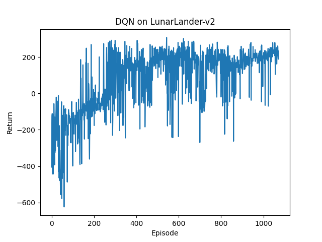
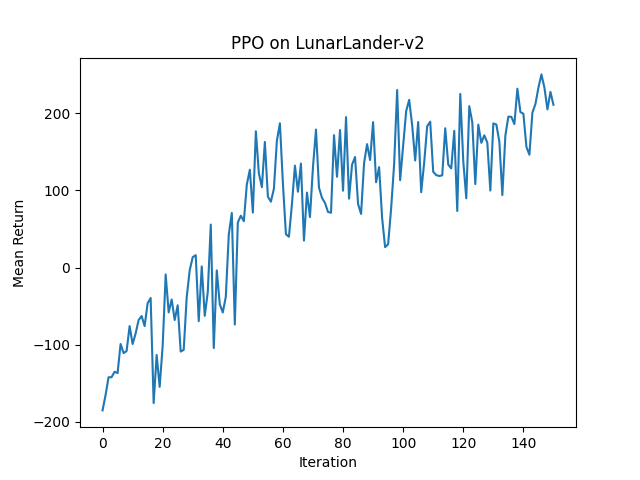

# RL from Scratch

从零手写 RL 算法 + DL 核心组件，不依赖高级框架，只用 PyTorch / NumPy + Gymnasium。CartPole / LunarLander / Pendulum 全部 solved，所有手写组件与 PyTorch 参考实现误差 < 1e-4。

## Benchmark

| 算法 | 环境 | 收敛指标 | 结果 | 备注 |
|------|------|---------|------|------|
| DQN | CartPole-v1 | 10-ep avg >= 495 | 728 episodes | from scratch |
| DQN | LunarLander-v2 | 100-ep avg >= 200 | 938 episodes | 前 380ep 无信号，突破后快速拉升 |
| PPO | CartPole-v1 | 10-ep avg >= 495 | 62 iterations | 7 轮调参后稳定 |
| PPO | LunarLander-v2 | 100-ep avg >= 200 | 405 iterations | 曲线平滑攀升，无负区 |
| SAC | Pendulum-v1 | eval return | ~ -120 | lr 3e-4 + learning_starts 5000 + clip_grad |
| REINFORCE | CartPole-v1 | 10-ep avg >= 495 | ~800 episodes | MC policy gradient |
| REINFORCE + Baseline | CartPole-v1 | 10-ep avg >= 495 | ~400 episodes | value network 降方差 |

## 收敛曲线

### DQN on LunarLander-v2


### PPO on LunarLander-v2


## 安装 & 运行

```bash
git clone https://github.com/lizh586/rl-from-scratch.git
cd rl-from-scratch
pip install -r requirements.txt
```

每个算法独立运行：

```bash
# DQN on CartPole
python dqn/dqn_handcraft.py

# PPO on CartPole
python ppo/ppo_handcraft.py

# SAC on Pendulum
python sac/sac_handcraft.py

# REINFORCE on CartPole
python reinforce/reinforce_cartpole.py
```

## 目录结构

```
rl-from-scratch/
├── README.md
├── requirements.txt
├── images/
├── dqn/
├── ppo/
├── sac/
├── reinforce/
└── dl/
    ├── autograd/          # NumPy 反向传播框架
    ├── transformer/       # MHA + PE + EncoderBlock
    ├── cnn/               # conv2d / LeNet / ResNet
    ├── rnn/               # LSTM / GRU cell
    └── tokenizer/         # BPE + Embedding
```

## 踩坑记录

- **SAC Q 网络 lr 过大**：qf1_loss 频繁 spike（500-900），eval return 大幅振荡。lr 从 1e-3 降到 3e-4 + gradient clipping 后稳定。
- **DQN epsilon 衰减过快**：每 episode 衰减导致 epsilon 过早趋近 0.01，探索不足。改为每 step 衰减。
- **learning_starts 不够**：buffer 没填满就开始训练，数据多样性不足。延迟到 5000 steps 后启动训练。

## DL 核心组件

所有组件手写实现，与 PyTorch 参考结果逐项验证。

| 组件 | 文件 | 验证 |
|------|------|------|
| NumPy 反向传播框架 | `dl/autograd/engine.py` `mlp.py` | 41 参数 MLP 梯度与 torch 误差 < 1e-5 |
| Transformer Encoder | `dl/transformer/attention.py` | MHA + PE + EncoderBlock，全部维度测试通过 |
| CNN | `dl/cnn/conv2d.py` `lenet.py` `resnet_block.py` | LeNet Fashion-MNIST 90.08% / ResNet 92.48% |
| RNN | `dl/rnn/lstm_cell.py` `gru_cell.py` | LSTM diff 2.98e-8 / GRU diff 1.2e-7 |
| BPE Tokenizer | `dl/tokenizer/bpe_tokenizer.py` `embedding_numpy.py` | encode/decode round-trip + Embedding 查表验证 |

```bash
# 反向传播框架
python dl/autograd/engine.py

# Transformer
python dl/transformer/attention.py

# RNN cell
python dl/rnn/lstm_cell.py
python dl/rnn/gru_cell.py
```

## 技术博客

详细讲解见：[从零手写 DQN / PPO / SAC：三个强化学习算法的实战记录](https://zhuanlan.zhihu.com/p/2046555983841908330)
